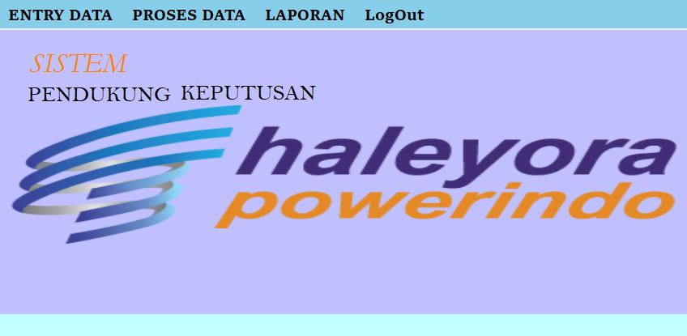
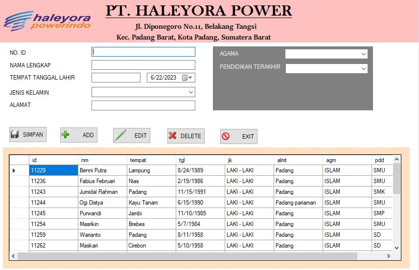
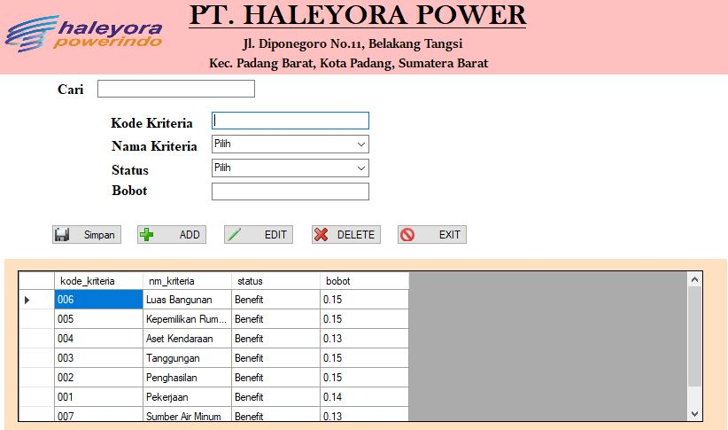
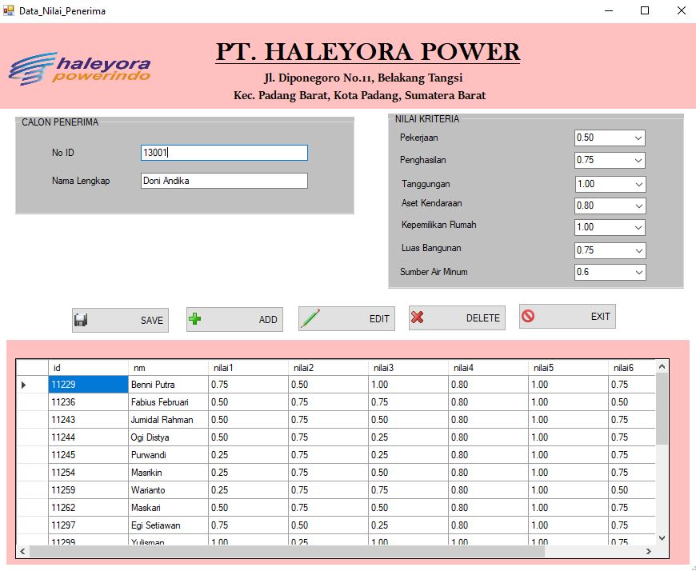
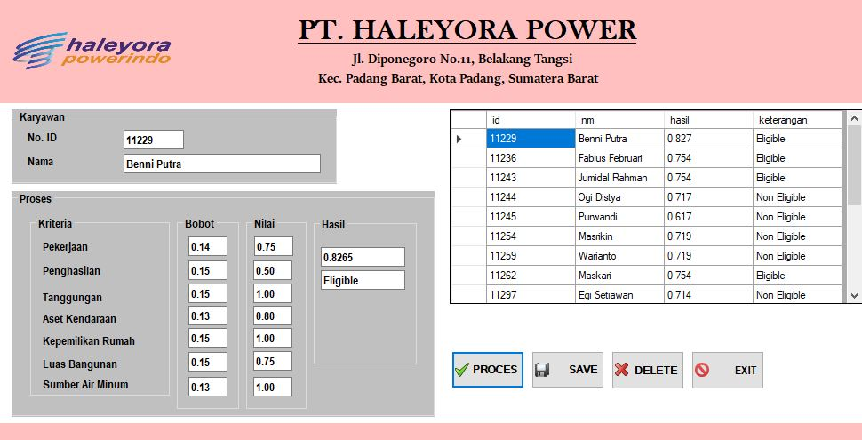
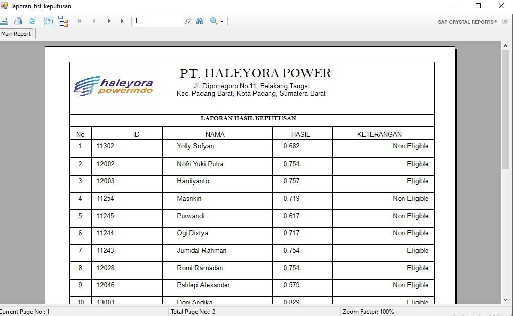

# SPK KELAYAKAN PEMBERIAN SUBSIDI LISTRIK METODE MFEP DENGAN VISUAL BASIC
Sistem Pendukung Keputusan (SPK) Kelayakan Pemberian Subsidi Listrik dengan metode MFEP (Metode Multifactor Evaluation Process) adalah sebuah sistem yang menggunakan logika fuzzy dan analisis ekonomi untuk membantu pengambilan keputusan. Metode MFEP menggabungkan konsep-konsep dari logika fuzzy dengan prinsip-prinsip ekonomi untuk memodelkan ketidakpastian dan tidaknyata dalam pengambilan keputusan.
##### Published Journal 

## Menu Application
- Entry Data Calon Penerima
- Entry Data Kriteria
- Entry Penilaian
- Proses Perhitungan
- Laporan Keputusan
- ✨Magic ✨

## Tech
Aplikasi ini dibangun dengan menggunakan:
- [Visual Basic .NET] - sebuah bahasa pemrograman yang merupakan bagian dari platform .NET Framework. VB.NET adalah penerus dari Visual Basic 6.0 dan dikembangkan oleh Microsoft. Bahasa ini dirancang untuk memudahkan pengembangan aplikasi berbasis Windows dengan menyediakan sintaks yang mudah dipahami dan alat bantu yang kuat
- [XAMPP] - sebuah paket perangkat lunak yang digunakan untuk membuat dan mengelola lingkungan pengembangan web lokal
- [MySQL Connector/ODBC] - sebuah driver atau konektor yang digunakan untuk menghubungkan aplikasi dengan basis data MySQL melalui antarmuka ODBC (Open Database Connectivity).
- [Crystal Reports] - sebuah aplikasi perangkat lunak yang digunakan untuk merancang, membuat, dan menghasilkan laporan interaktif. Aplikasi ini dikembangkan oleh perusahaan SAP dan telah menjadi salah satu alat yang populer dalam pengembangan laporan bisnis.

## Tampilan Aplikasi
- Login

- Menu Utama

- Data Penerima

- Data Kriteria

- Data Penilaian

- Proses Perhitungan

- Laporan

